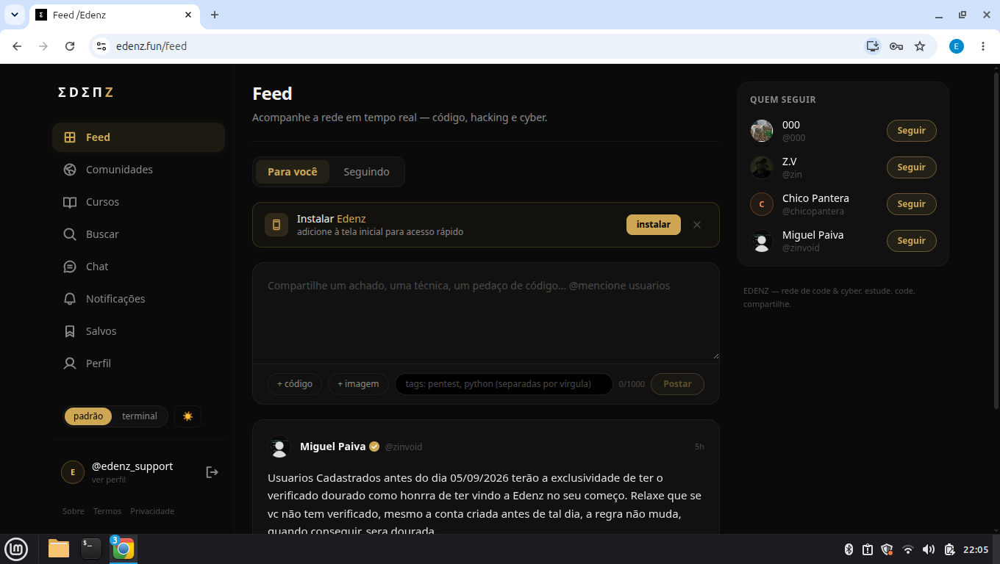

  

<h1 align="center">Edenz</h1>

  Code, create and share.

# Edenz

> **Code, create and share.**

A **Edenz** é uma plataforma criada para pessoas que gostam de tecnologia, programação e criação digital.

Nosso objetivo é construir um espaço onde pessoas possam **aprender, criar projetos, compartilhar conhecimento e se conectar com outras pessoas**.

---

## 🌱 Sobre a Edenz

A Edenz nasceu da ideia de reunir diferentes partes do universo de tecnologia em um só lugar.

A plataforma busca combinar:

* 💻 **Tecnologia & programação**
* 📚 **Cursos e aprendizado**
* 🧑‍💻 **Projetos e criação**
* 🌐 **Comunidade**
* 💬 **Comunicação**
* 📖 **Compartilhamento de conhecimento**

Mais do que apenas uma plataforma, a Edenz é um projeto em constante evolução.

---

## 🚀 O projeto

Este repositório contém materiais públicos relacionados à apresentação e desenvolvimento da Edenz.

A maior parte da infraestrutura, lógica e componentes internos da plataforma **não faz parte deste repositório**.

> Este repositório existe principalmente como uma porta de entrada para conhecer o projeto.

---

## 🛠️ Tecnologias

A Edenz utiliza tecnologias modernas para construir uma experiência rápida, escalável e agradável.

Algumas das tecnologias utilizadas no ecossistema incluem:

* **TypeScript**
* **React**
* **Next.js**
* **Tailwind CSS**
* **Supabase**
* **Cloudflare**
* **Vercel**

A stack pode mudar conforme o projeto evolui.

---

## ✨ O que estamos construindo

A Edenz possui diferentes áreas voltadas para criação e comunidade.

### 📚 Cursos

Um espaço para pessoas compartilharem conhecimento e criarem conteúdos educacionais.

### 🌐 Comunidade

Um ambiente para descobrir projetos, ideias e conteúdos de outras pessoas.

### 💬 Mensagens

Comunicação entre usuários em tempo real.

### 💻 Projetos

Um espaço voltado para criação, experimentação e compartilhamento.

---

## 🎯 Nossa visão

Queremos tornar tecnologia e criação digital mais acessíveis.

A ideia é que qualquer pessoa possa chegar com uma ideia e encontrar ferramentas, conhecimento e pessoas para transformar essa ideia em algo real.

**Aprender. Criar. Compartilhar.**

---

## 📈 Status

🚧 **Edenz está em desenvolvimento ativo.**

Novos recursos, melhorias e mudanças fazem parte do processo.

---

## 🤝 Contribuições

Este repositório é público, mas isso não significa que todo o código da Edenz seja open source.

Contribuições, sugestões e ideias são bem-vindas quando aplicáveis ao conteúdo público do projeto.

---

## 🔗 Edenz

**Website:** https://www.edenz.fun

**Email de Suporte:** supportedenz@gmail.com

---

  <strong>Edenz</strong> 
  Code, create and share.

