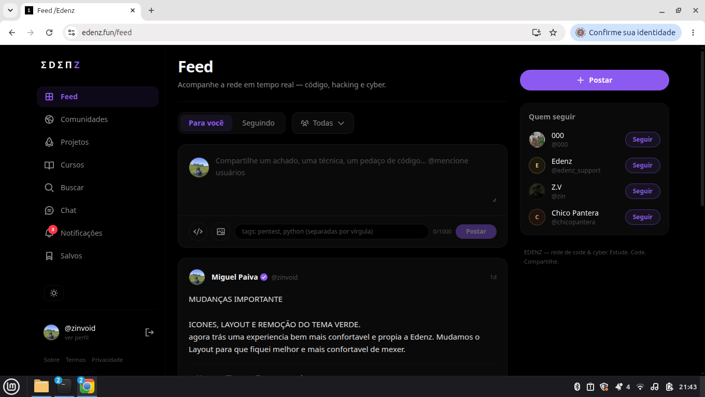

  

<h1 align="center">Edenz</h1>

  <strong>Code, create and share.</strong>

  
  

  <a href="#sobre">Sobre</a> •
  <a href="#projeto">O projeto</a> •
  <a href="#tecnologias">Tecnologias</a> •
  <a href="#funcionalidades">Funcionalidades</a> •
  <a href="#visao">Visão</a> •
  <a href="#status">Status</a> •
  <a href="#contribuicoes">Contribuições</a> •
  <a href="#contato">Contato</a>

  

---

## 🌱 Sobre a Edenz

A **Edenz** é uma plataforma criada para pessoas que gostam de tecnologia, programação e criação digital. Nosso objetivo é construir um espaço onde pessoas possam **aprender, criar projetos, compartilhar conhecimento e se conectar com outras pessoas**.

A Edenz nasceu da ideia de reunir diferentes partes do universo de tecnologia em um só lugar. A plataforma busca combinar:

- 💻 **Tecnologia & programação**
- 📚 **Cursos e aprendizado**
- 🧑‍💻 **Projetos e criação**
- 🌐 **Comunidade**
- 💬 **Comunicação**
- 📖 **Compartilhamento de conhecimento**

Mais do que apenas uma plataforma, a Edenz é um projeto em constante evolução.

---

## 🚀 O projeto

Este repositório contém materiais públicos relacionados à apresentação e ao desenvolvimento da Edenz. A maior parte da infraestrutura, lógica e componentes internos da plataforma **não faz parte deste repositório**.

> 💡 Este repositório existe principalmente como uma porta de entrada para conhecer o projeto.

---

## 🛠️ Tecnologias

A Edenz utiliza tecnologias modernas para construir uma experiência rápida, escalável e agradável.

  
  
  
  
  
  
  

> A stack pode mudar conforme o projeto evolui.

---

## ✨ O que estamos construindo

A Edenz possui diferentes áreas voltadas para criação e comunidade.

| Área | Descrição |
|---|---|
| 📚 **Cursos** | Espaço para pessoas compartilharem conhecimento e criarem conteúdos educacionais. |
| 🌐 **Comunidade** | Ambiente para descobrir projetos, ideias e conteúdos de outras pessoas. |
| 💬 **Mensagens** | Comunicação entre usuários em tempo real. |
| 💻 **Projetos** | Espaço voltado para criação, experimentação e compartilhamento. |

---

## 🎯 Nossa visão

Queremos tornar tecnologia e criação digital mais acessíveis. A ideia é que qualquer pessoa possa chegar com uma ideia e encontrar ferramentas, conhecimento e pessoas para transformar essa ideia em algo real.

<strong>Aprender. Criar. Compartilhar.</strong>

---

## 📈 Status

🚧 **Edenz está em desenvolvimento ativo.**

Novos recursos, melhorias e mudanças fazem parte do processo.

---

## 🤝 Contribuições

Este repositório é público, mas isso não significa que todo o código da Edenz seja open source.

Contribuições, sugestões e ideias são bem-vindas quando aplicáveis ao conteúdo público do projeto.

---

## 🔗 Contato

  
  

---

   
  <strong>Edenz</strong> 
  Code, create and share.

  <a href="#topo">⬆ Voltar ao topo</a>

